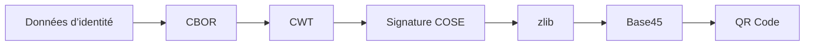

# Claim 169

<div class="hero-section" markdown>
<h1 class="hero-title">Bibliothèque de QR codes MOSIP Claim 169</h1>
<p>Encoder et vérifier des identifiants d’identité numérique vérifiables hors ligne</p>
<div class="cta-group">
<a href="playground/" class="cta-button">Essayer le Playground</a>
<a href="core/specification/" class="cta-button cta-button-secondary">Lire la spécification</a>
</div>
</div>

## Qu’est-ce que Claim 169 ?

Claim 169 est une revendication (claim) **CWT** (CBOR Web Token) [enregistrée auprès de l’IANA](https://www.iana.org/assignments/cwt/cwt.xhtml), destinée à encoder des identifiants d’identité dans des QR codes. Elle permet une **vérification hors ligne** de documents d’identité, sans connectivité réseau.

<div class="diagram" markdown>



</div>

## Choisissez votre SDK

<div class="sdk-grid" markdown>

<div class="sdk-card" markdown>
<h3>Python</h3>
<p>Bindings natifs avec annotations de types complètes</p>
<a href="sdk/python/" class="md-button">Commencer</a>
<code>pip install claim169</code>
</div>

<div class="sdk-card" markdown>
<h3>Rust</h3>
<p>Bibliothèque cœur avec parsing « zero-copy »</p>
<a href="sdk/rust/" class="md-button">Commencer</a>
<code>cargo add claim169-core</code>
</div>

<div class="sdk-card" markdown>
<h3>TypeScript</h3>
<p>Navigateur & Node.js via WebAssembly</p>
<a href="sdk/typescript/" class="md-button">Commencer</a>
<code>npm install claim169</code>
</div>

<div class="sdk-card" markdown>
<h3>Kotlin</h3>
<p>Android & JVM via bindings natifs</p>
<a href="sdk/kotlin/" class="md-button">Commencer</a>
<code>implementation(&quot;fr.acn.claim169:claim169-core:&lt;version&gt;&quot;)</code>
</div>

<div class="sdk-card" markdown>
<h3>Java</h3>
<p>JDK 17+ avec API lambda</p>
<a href="sdk/java/" class="md-button">Commencer</a>
<code>implementation(&quot;fr.acn.claim169:claim169-core:&lt;version&gt;&quot;)</code>
</div>

</div>

## Fonctionnalités clés

<div class="feature-grid" markdown>

<div class="feature-card" markdown>
### Vérification hors ligne
Vérifiez des identifiants sans accès réseau grâce à des signatures cryptographiques intégrées.
</div>

<div class="feature-card" markdown>
### Encodage compact
Optimisé pour les QR codes grâce à CBOR, la compression zlib et l’encodage Base45.
</div>

<div class="feature-card" markdown>
### Cryptographie robuste
Signatures Ed25519 et ECDSA P-256, avec chiffrement AES-GCM optionnel.
</div>

<div class="feature-card" markdown>
### Compatible HSM/KMS
Utilisez votre propre fournisseur crypto pour HSM ou KMS cloud.
</div>

</div>

## Exemple rapide

=== "Python"

    ```python
    from claim169 import decode

    qr_data = "..."  # Base45 depuis le QR code
    public_key = bytes.fromhex("...")  # Clé publique Ed25519 de l'émetteur

    result = decode(qr_data, verify_with_ed25519=public_key)

    print(f"Name: {result.claim169.full_name}")
    print(f"ID: {result.claim169.id}")
    print(f"Verified: {result.verification_status}")
    ```

=== "Rust"

    ```rust
    use claim169_core::Decoder;

    let qr_data = "...";  // Base45 depuis le QR code
    let public_key = hex::decode("...")?;  // Clé publique Ed25519 de l’émetteur

    let result = Decoder::new(qr_data)
        .verify_with_ed25519(&public_key)?
        .decode()?;

    println!("Name: {:?}", result.claim169.full_name);
    println!("ID: {:?}", result.claim169.id);
    println!("Verified: {}", result.verification_status);
    ```

=== "TypeScript"

    ```typescript
    import { Decoder } from 'claim169';

    const qrData = "...";  // Base45 depuis le QR code
    const publicKey = new Uint8Array([...]);  // Clé publique Ed25519 de l’émetteur

    const result = new Decoder(qrData)
      .verifyWithEd25519(publicKey)
      .decode();

    console.log(`Name: ${result.claim169.fullName}`);
    console.log(`ID: ${result.claim169.id}`);
    console.log(`Verified: ${result.verificationStatus}`);
    ```

## Essayez maintenant

Testez l’encodage et le décodage dans votre navigateur avec le [Playground interactif](playground.md).

## Pour aller plus loin

<div class="quick-links">

<a href="core/specification/" class="quick-link">
<strong>Spécification</strong>
Format sur le fil, clés CBOR, tables de champs
</a>

<a href="core/security/" class="quick-link">
<strong>Sécurité</strong>
Modèle de menaces, valeurs sûres, validation
</a>

<a href="core/glossary/" class="quick-link">
<strong>Glossaire</strong>
Terminologie CBOR, COSE, CWT
</a>

</div>
