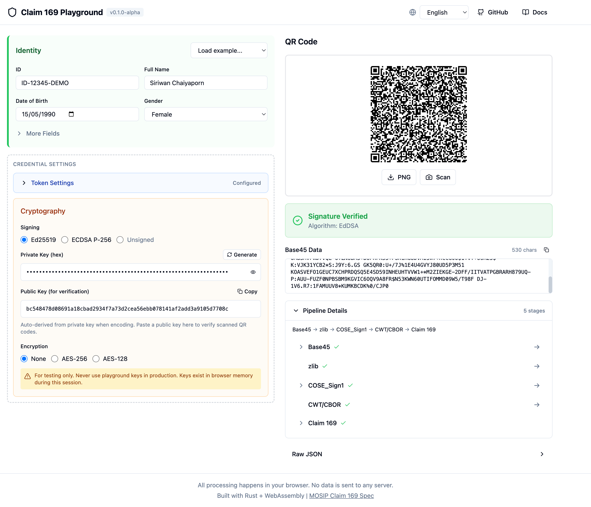

# Playground interactif

Essayez l'encodage et le décodage des identifiants Claim 169 directement dans votre navigateur.

[Ouvrir le Playground](https://jeremi.github.io/claim-169/){ .md-button .md-button--primary }

## Fonctionnalités

Le playground utilise une disposition unifiée à deux panneaux inspirée de [jwt.io](https://jwt.io), avec une synchronisation bidirectionnelle en temps réel.

### Panneau gauche - Identité et paramètres

- **Champs d'identité** - Remplissez les données démographiques (nom, date de naissance, email, adresse, etc.)
- **Paramètres du credential** - Configuration groupée pour :
    - **Paramètres du jeton** - Émetteur, sujet et horodatages (repliable)
    - **Cryptographie** - Options de signature et de chiffrement
- **Clés auto-générées** - Nouvelles clés cryptographiques générées lors du changement de méthode
- **Charger des exemples** - Données de test pré-remplies et codes QR d'exemple

### Panneau droit - QR Code et vérification

- **Affichage du QR Code** - Code QR mis à jour en temps réel lors de l'édition
- **Badge de vérification** - Affiche le statut de la signature (vérifié, non vérifié, invalide)
- **Données Base45** - Données encodées brutes avec bouton de copie
- **Scanner QR** - Utilisez votre caméra pour scanner des codes QR existants
- **Détails du pipeline** - Vue extensible des étapes d'encodage

## Synchronisation en temps réel

Les modifications se propagent automatiquement dans les deux sens :

- **Modifier les champs d'identité** → Le QR code se régénère instantanément
- **Coller/scanner des données QR** → Les champs d'identité se remplissent automatiquement

Pas besoin de boutons « Générer » ou « Décoder ».

## Démarrage rapide

### Créer un credential

1. Ouvrez le [Playground](../)
2. Sélectionnez **Charger un exemple → Identité démo** pour charger des données de test
3. Modifiez les champs d'identité selon vos besoins
4. Le QR code se met à jour automatiquement
5. Téléchargez le PNG ou copiez les données Base45

### Vérifier un credential

1. Cliquez sur **Scanner** pour scanner un QR code, ou collez des données Base45
2. Les champs d'identité se remplissent automatiquement
3. Pour vérifier la signature :
    - Collez la clé publique de l'émetteur dans le champ **Clé publique**
    - Sélectionnez l'algorithme correct (Ed25519 ou ECDSA P-256)
4. Le badge de vérification affiche le résultat

### Gestion des clés

- **Bouton Générer** - Crée de nouvelles clés pour l'algorithme sélectionné
- **Clé publique** - Dérivée automatiquement lors de l'encodage, modifiable pour la vérification
- Les clés sont générées par session pour la sécurité (ne jamais réutiliser les clés du playground)

## Technologie

Le playground s'exécute entièrement dans votre navigateur :

- **WebAssembly** - SDK claim169 compilé en WASM
- **React** - Framework UI moderne
- **Web Crypto API** - Génération de clés (Ed25519, ECDSA P-256, AES)
- **html5-qrcode** - Scan QR via caméra

Aucune donnée n'est envoyée à un serveur.

## Capture d'écran

## Code source

Le code source du playground est disponible sur :
[github.com/jeremi/claim-169/tree/main/playground](https://github.com/jeremi/claim-169/tree/main/playground)
