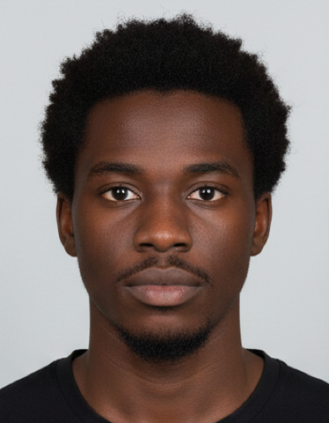
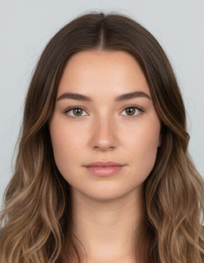
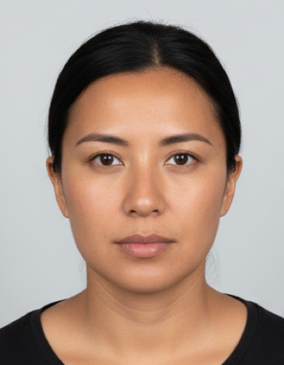
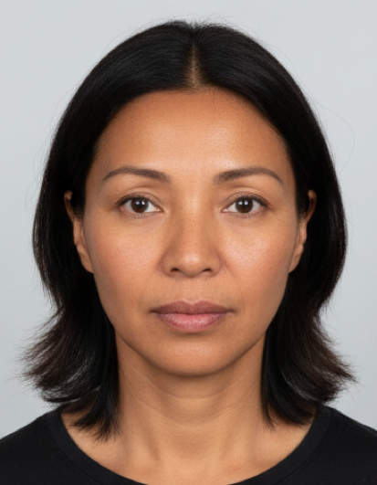

# Sample ID pictures

These images are **AI-generated** and are provided for **demo purposes only** (e.g. testing the Claim 169 playground). They do not represent real identity documents or persons.

Files `sample_id_1.png`–`sample_id_4.png` are resized to **413×531 px** (35×45 mm at 300 DPI), a standard ID/passport photo size.

| sample_id_1 | sample_id_2 | sample_id_3 | sample_id_4 |
|-------------|-------------|-------------|-------------|
|  |  |  |  |
